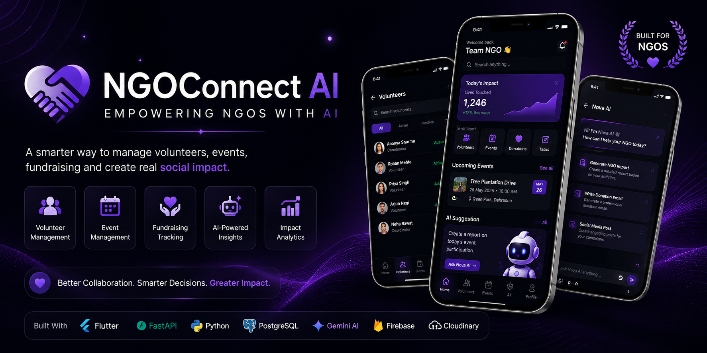
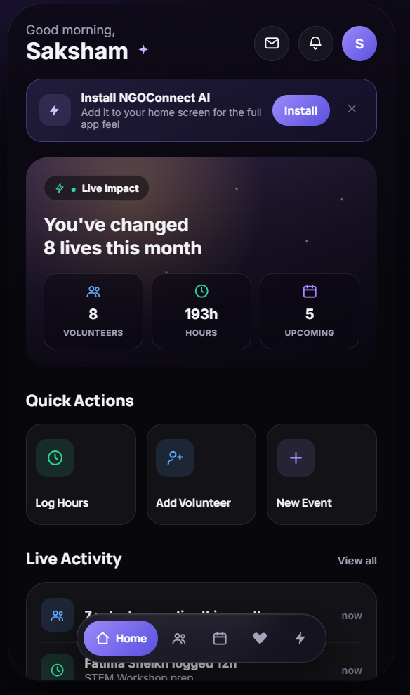
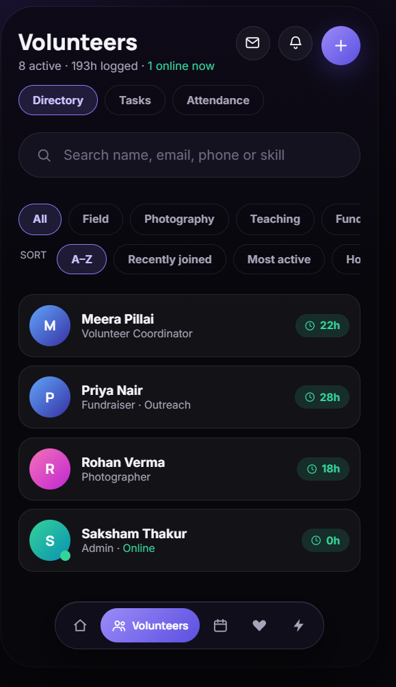
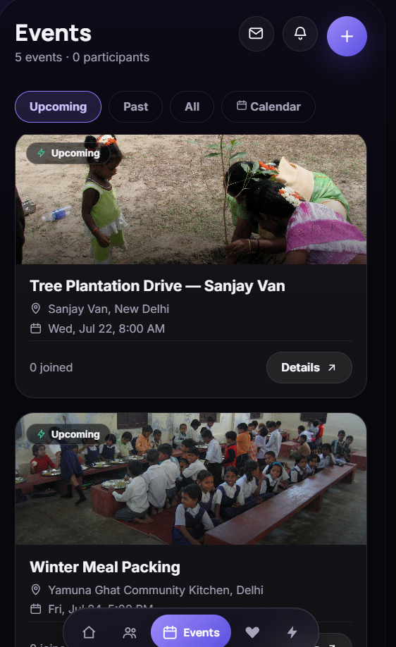
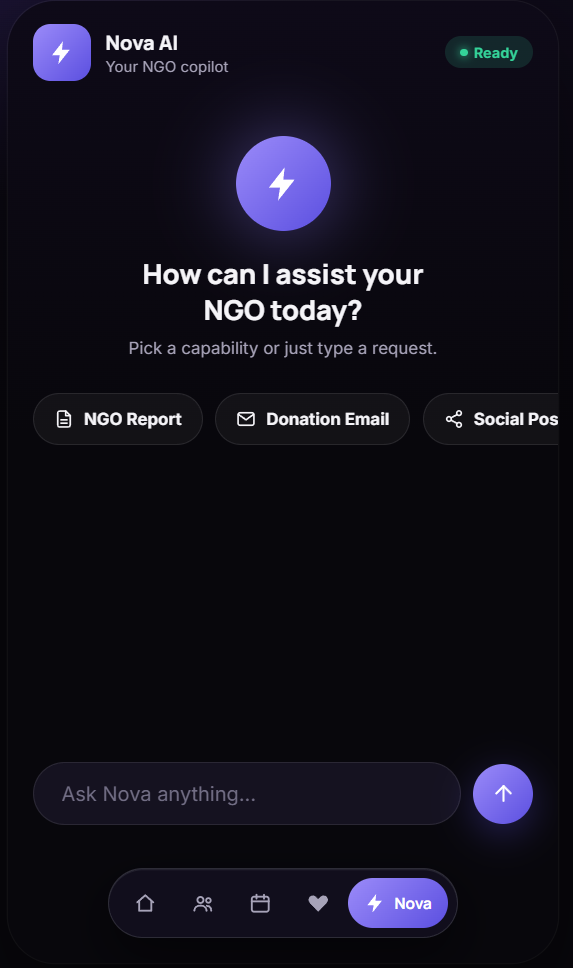
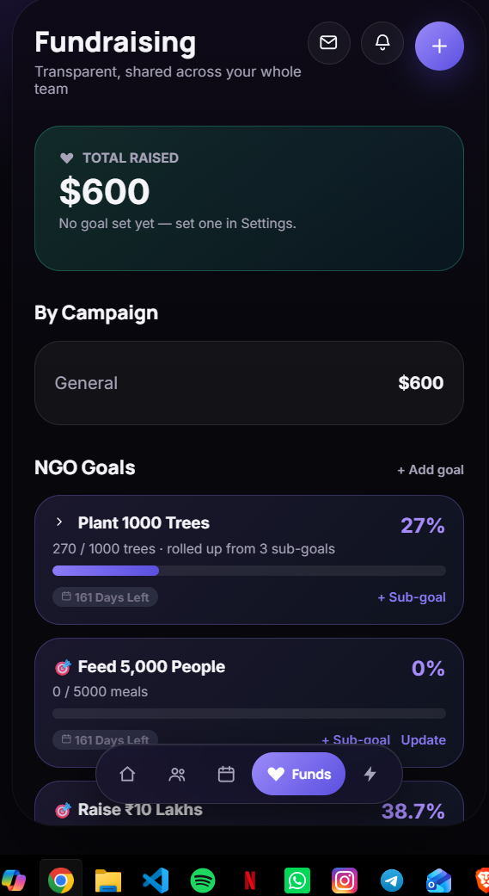
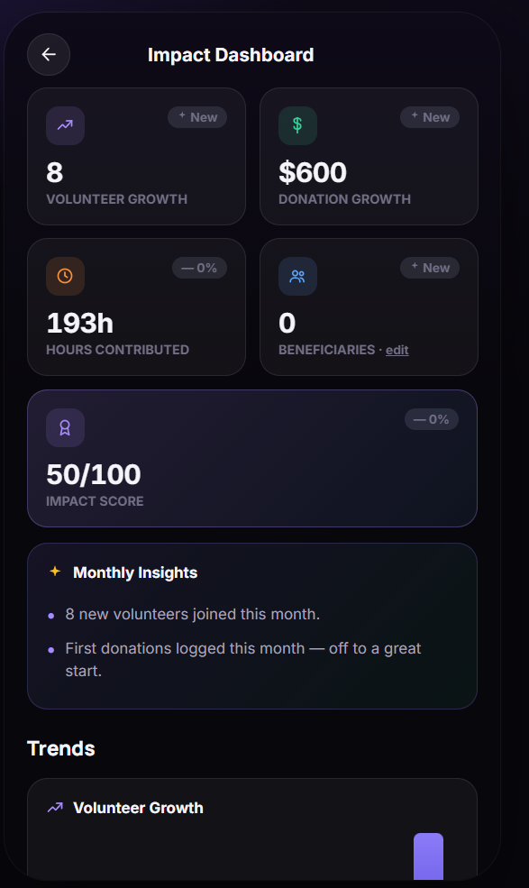

<div align="center">



# NGOConnect AI

### Empowering NGOs with AI

*A modern platform to manage volunteers, events, fundraising, and organizational operations.*

<p>


</p>

</div>

---

# 📖 About

NGOConnect AI is a modern NGO Management Platform built to simplify the everyday operations of non-profit organizations.

Instead of relying on spreadsheets, paperwork, and scattered communication tools, NGOs can manage everything from one intelligent platform.

The application focuses on improving productivity, collaboration, and social impact through AI-powered tools and an intuitive user experience.

---

# ✨ Features

## 🏠 Dashboard

- Live Impact Dashboard
- Volunteer Statistics
- Monthly Insights
- Quick Actions
- AI Suggestions
- Activity Feed

---

## 👥 Volunteer Management

- Volunteer Directory
- Attendance Tracking
- Task Assignment
- Search & Filters
- Online Status
- Skills Management

---

## 🔐 Role-Based Access

Three permission levels ensure secure collaboration.

### 👑 Admin

- Full platform access
- Invite team members
- Organization settings
- Analytics
- Fundraising

### 👨‍💼 Manager

- Manage volunteers
- Create events
- Assign tasks
- View fundraising

### 🙋 Volunteer Coordinator

- Attendance
- Volunteer directory
- Task management

---

## 📅 Event Management

- Create Events
- Calendar View
- Event Details
- Gallery
- Feedback System
- Attendance Tracking
- Google Maps Integration

---

## ❤️ Fundraising

- Campaign Management
- Donation Tracking
- Goal Progress
- Impact Statistics

---

## 🤖 Nova AI

Your intelligent NGO Copilot.

Nova helps NGOs by generating:

- NGO Reports
- Donation Emails
- Social Media Posts
- Grant Proposal Drafts
- Monthly Insights
- Impact Analysis

---

# 📱 Screenshots

## Login

<p align="center">

</p>

---

## Home Dashboard

<p align="center">

</p>

---

## Volunteer Management

<p align="center">

</p>

---

## Event Management

<p align="center">

</p>

---

## Nova AI

<p align="center">

</p>

---

## Fundraising

<p align="center">

</p>

---

## Analytics Dashboard

<p align="center">

</p>

---

# 🛠 Tech Stack

## Frontend

- Flutter
- Dart
- Riverpod

## Backend

- FastAPI
- Python
- Node.js

## Database

- PostgreSQL

## Authentication

- JWT Authentication

## AI

- Gemini AI

## Cloud

- Firebase
- Cloudinary

---

# 🚀 Project Roadmap

- ✅ Volunteer Management
- ✅ Event Management
- ✅ Role-Based Access
- ✅ Nova AI
- ✅ Fundraising
- ✅ Analytics Dashboard
- ⏳ QR Attendance
- ⏳ Certificate Generator
- ⏳ Beneficiary Management
- ⏳ Inventory Management
- ⏳ Offline Support
- ⏳ Multi-NGO Support

---

# 📂 Folder Structure

```
NGO-CONNECT

assets/
screenshots/
public/

server.js
auth.js
db.js

package.json
README.md
LICENSE
```

---

# 💡 Why I Built This

Many NGOs still manage operations through spreadsheets, WhatsApp groups, and paperwork.

I wanted to explore how modern design, AI, and mobile-first workflows could simplify these processes and help organizations spend more time creating real impact.

---

# 🤝 Contributions

Contributions, ideas, and feedback are always welcome.

Feel free to open an issue or submit a pull request.

---

# 📬 Connect With Me

### 👨‍💻 Saksham Thakur

**GitHub**

https://github.com/thakur-saksham

**LinkedIn**

https://www.linkedin.com/in/saksham-thakurr/

---

<div align="center">

⭐ If you found this project interesting, consider giving it a star!

Made with ❤️ by Saksham Thakur

</div>
